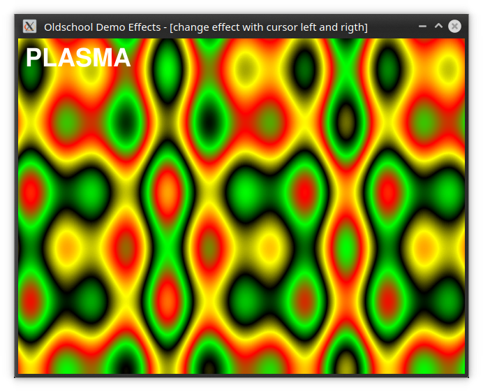

# Oldschool Demo Effects
## This is a compilation of old demo effects with sdl2 in a single application.

### [Latest windows version here](https://github.com/ThKattanek/oldschool_demo_effects/releases/latest)

original sdl version -> http://demo-effects.sourceforge.net

### All implemented effects
* Plasma
* Blob
* Fire
* Bob
* Copperbars
* Explosion
* Starield

### Using Libraries
* sdl2
* sdl2_ttf
* sdl2_image

### Build and installation under linux
```bash
git clone https://github.com/ThKattanek/oldschool_demo_effects.git
cd oldschool_demo_effects
git checkout 0.2.0
mkdir build
cd build
qmake .. PREFIX="/usr/local"
make 
sudo make install
```

## Screenshots



