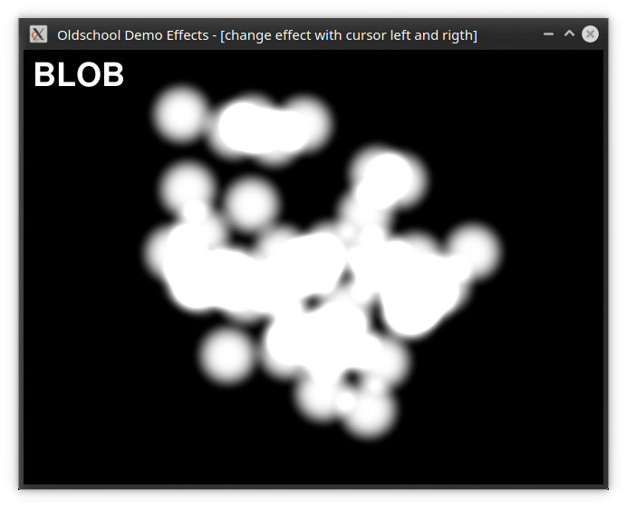
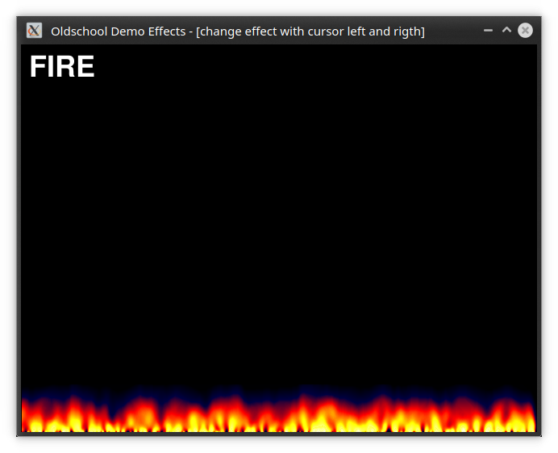

# Oldschool Demo Effects
## This is a compilation of old demo effects with sdl2 in a single application.

original sdl version -> http://demo-effects.sourceforge.net

### All implemented effects
* Plasma
* Blob
* Fire
* Bob
* Copperbars

### Using Libraries
* sdl2
* sdl2_ttf
* sdl2_image

#### !Buildsystem is here qmake!

## Screenshots

